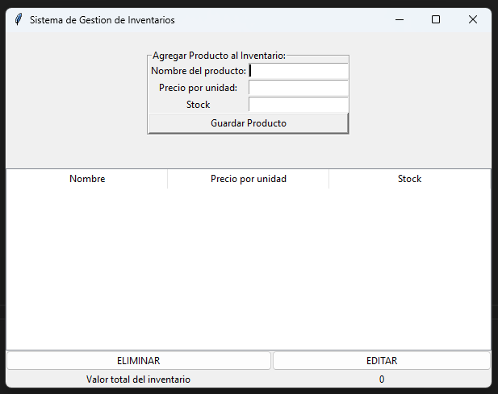
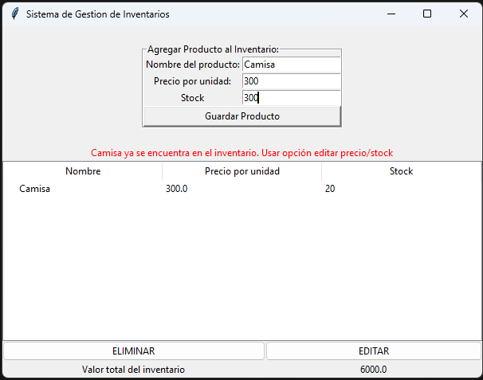
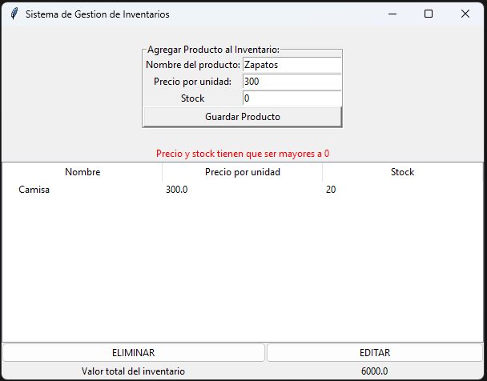
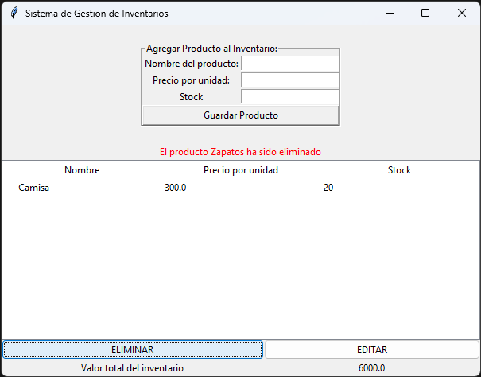
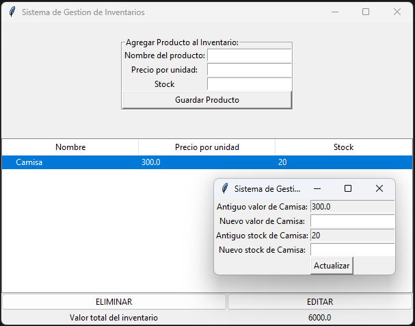

# Sistema de Gestion de Inventario

Hecho a partir de **Python 3**, con interfaz gráfica **TKinter** y **SQlite**.

##Restricciones 

-No se permite añadir dos veces el mismo producto

-No se pueden ingresar numeros menores o iguales a 0

-Para eliminar/editar se tiene que seleccionar el producto

